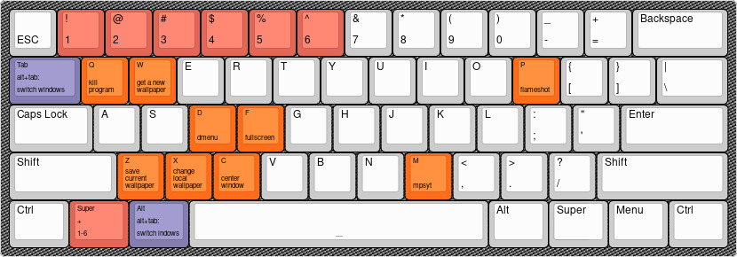

# dotfilez
[](https://hitsofcode.com/github/koutsie/dotfilez/view)


Updated (and outdated) dotfiles this time with sowm, openbox, qtile, i3 etc etc

## install:
Install deps:

```yay -S flameshot redshift imagemagick bash pamixer wget curl mps-youtube dunst git feh imlib2 sed screen kdeconnect-git openbox obconf obmenu-generator```

**and many many more... list outdated by like 2 years**


Install dotfilez:
NOTE: THE INSTALLER IS VERY VERY VERY OUT OF DATE, PLEASE PICK AND CHOOSE MANUALLY RATHER THAN USE THE INSTALLER!
```curl -fsSL https://raw.githubusercontent.com/koutsie/dotfilez/master/Installer%20v2/install.sh | bash```

### Notes:

> Brightness controls have been configured for an amdgpu laptop, please make sure to change those to match your own solution.


> Volume changing uses `pamixer` and only changes the current output, please make sure to edit as needed.


> Wallpaper changer uses unsplash's url api, please make sure to change it to your liking (currently: `nature` is used.).


## Depencies/Configured programs so far:
- flameshot
- pamixer
- wget
- curl
- mpsyt (mps-youtube)
- dunst
- git
- sowm (build automatically if using installer)
- feh
- imlib2
- xfce4-terminal
- sed
- screen
- bash
- imagemagick
- redshift
- kdeconnect
- polybar
**I STOPPED LISTING ALL THE PROGRAMS BECAUSE THERE ARE TOO MANY, PLEASE SEE MANUALLY AND ASK RATHER THAN TRUST THIS LIST!**

## Installs configs, not enabled by default:
- i3
- polybar
**FUCK**


## Default Layout

**OUTDATED**

*NOTE: default modifier is __Super__*


**Window Management**

| combo                      | action                 |
| -------------------------- | -----------------------|
| `Mouse`                    | focus under cursor     |
| `MOD4` + `Left Mouse`      | move window            |
| `MOD4` + `Right Mouse`     | resize window          |
| `MOD4` + `f`               | maximize toggle        |
| `MOD4` + `c`               | center window          |
| `MOD4` + `q`               | kill window            |
| `MOD4` + `1-9`             | desktop swap           |
| `MOD4` + `Shift` +`1-9`    | send window to desktop |
| `MOD1` + `TAB` (*alt-tab*) | focus cycle            |

------

**Shortcuts**

| combo                      | action                 |
| -------------------------- | -----------------------|
| `MOD4` + `p`                    | flameshot screenshot tool |
| `MOD4` + `m`      | mpsyt            |
| `MOD4` + `XF86_MonBrightnessUp`     | brightness up          |
| `MOD4` + `XF86_MonBrightnessDown`               | brightness down        |
| `MOD4` + `XF86_AudioRaiseVolume`               | volume up          |
| `MOD4` + `XF86_AudioLowerVolume`               | volume down            |
| `MOD4` + `w`             | get a new random wallpaper           |
| `MOD4` + `z`    | save current wallpaper to favourites |
| `MOD4` + `x` | get a random wallpaper from favourites            |


## Editors:
For nano: https://github.com/scopatz/nanorc
**ALSO VERY VERY OUTDATED**
For geany: `tango light` with `sourcecode variable bold`


# based software
**STILL BASED**
https://github.com/cylgom/ly/

